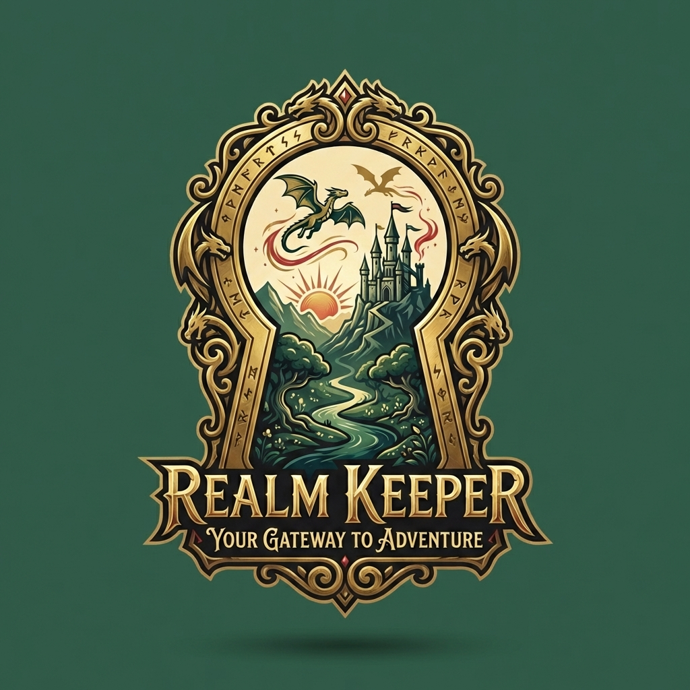

# Realm Keeper

<p align="center">
  
</p>

**Realm Keeper** is a web-based D&D 5e encounter manager and virtual tabletop designed for Dungeon Masters. It streamlines combat tracking, monster management, and battlemap visualization—all in one place.

## ✨ Features

### 🎭 Encounter Management
- **Create & Save Encounters**: Build encounters with monsters from Open5e's SRD database
- **Party Integration**: Define your party once; they're automatically included in every encounter
- **Initiative Tracking**: Roll initiative, track turn order, and manage HP in real-time

### 🗺️ Interactive Battlemap
- **Map Library**: Upload and save battle maps for reuse across sessions
- **Tokens**: Drag-and-drop token placement with size support (Small to Huge)
- **Fog of War**: Reveal areas progressively as players explore
- **AOE Tools**: Draw spell effects (circles, cones, cubes, lines) with customizable colors
- **Grid Controls**: Adjustable grid overlay for tactical positioning
- **Player View**: Separate window for players to see the map without DM tools

### 📖 Bestiary & Spellbook
- **Monster Search**: Search the Open5e database for SRD monsters
- **Custom Monsters**: Import custom statblocks via AI-powered parsing
- **Spellbook**: Browse and filter the complete SRD spell list
- **Custom Spells**: Import homebrew spells in JSON format

### 🎲 Dice Roller
- **Visual Builder**: Click dice buttons to build complex rolls
- **Quick Notation**: Type rolls directly (e.g., `2d6+3`)
- **Advantage/Disadvantage**: Toggle for d20 rolls
- **Roll History**: Keep track of recent rolls

## 🎨 Design Philosophy

Realm Keeper embraces a **classic adventure theme** inspired by vintage D&D aesthetics:

| Element | Color | Hex |
|---------|-------|-----|
| Parchment (Background) | Light cream | `#F4EBD0` |
| Forest Green (Header) | Deep green | `#2E5D4B` |
| Dragonfire Red (Accent) | Warm red | `#C84B31` |
| Aged Gold (Borders) | Antique gold | `#D4AF37` |
| Iron Ink (Text) | Near-black brown | `#2C211B` |

Typography uses **Crimson Text** for headers (a classic serif) and **Segoe UI** for body text.

## 🚀 Setup

### Prerequisites
- [Node.js](https://nodejs.org/) (v18 or higher recommended)
- [Anthropic API Key](https://console.anthropic.com/) (for AI statblock parsing)

### Installation

1. **Clone the repository**
   ```bash
   git clone https://github.com/yourusername/realm-keeper.git
   cd realm-keeper
   ```

2. **Install dependencies**
   ```bash
   npm install
   ```

3. **Configure environment**
   Create a `.env` file in the project root:
   ```env
   ANTHROPIC_API_KEY=your_api_key_here
   ```

4. **Start the server**
   ```bash
   npm start
   ```

5. **Open in browser**
   Navigate to `http://localhost:3000`

## 📁 Project Structure

```
realm-keeper/
├── assets/           # Logo and static assets
├── backgrounds/      # Uploaded map images (auto-created)
├── css/              # Stylesheets
├── data/             # Persistent JSON data stores
├── js/               # Client-side JavaScript modules
├── index.html        # Main application
├── battlemap.html    # Player view (read-only map)
└── server.js         # Express server + API routes
```

## 🔧 Tech Stack

- **Frontend**: Vanilla HTML, CSS, JavaScript (no frameworks)
- **Backend**: Node.js + Express
- **APIs**: 
  - [Open5e](https://open5e.com/) for SRD monsters and spells
  - [Anthropic Claude](https://anthropic.com/) for AI statblock parsing
- **Storage**: File-based JSON persistence

## 📜 License

This project uses content from the D&D 5e SRD under the [Open Gaming License](https://open5e.com/legal).

---

*Built with ❤️ for Dungeon Masters everywhere*
