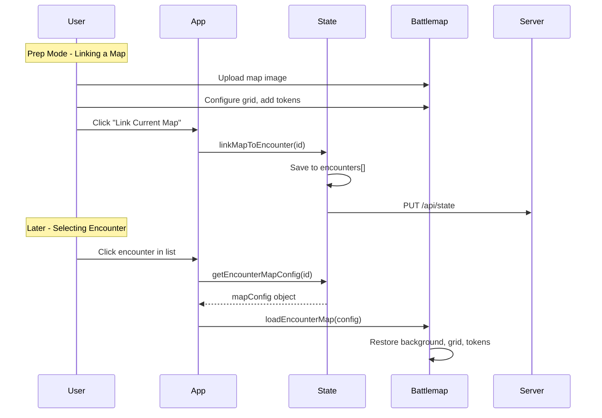

# Encounter Map Integration

## Overview

Allow Encounters to reference a specific map image and configuration. When a user selects an encounter from the list, the Battlemap module should automatically load the associated map, grid settings, and optionally pre-placed tokens.

---

## Current State

### Encounter Data Model (`state.js`)
```javascript
// Current encounter structure
{
    id: string,
    name: string,
    monsters: [{ slug, name, cr, qty }]
}
```

### Battlemap State (`battlemap.js`)
```javascript
state: {
    background: null,          // Base64 data URL of the image
    backgroundImage: null,     // HTMLImageElement
    gridSize: 50,
    showGrid: true,
    tokens: [],
    zoom: 1,
    panX: 0,
    panY: 0
}
```

**Problem**: These two systems are completely decoupled. There is no way to associate a map with an encounter.

---

## Proposed Changes

### 1. Extend Encounter Schema

#### [MODIFY] [state.js](file:///c:/Users/Jesse/Organize/Personal/jvdnd/js/state.js)

Add optional `mapConfig` property to encounters:

```javascript
// New encounter structure
{
    id: string,
    name: string,
    monsters: [{ slug, name, cr, qty }],
    mapConfig: {                    // NEW - optional
        mapId: string | null,       // Reference to saved map (Phase 2)
        mapData: string | null,     // Inline Base64 for quick saves
        gridSize: number,           // Default: 50
        showGrid: boolean,          // Default: true
        tokens: [{                  // Pre-placed tokens
            id: string,
            name: string,
            color: string,
            size: number,
            x: number,
            y: number
        }]
    }
}
```

Add helper functions:

```javascript
// Save current battlemap state to encounter
linkMapToEncounter(encounterId) {
    const encounter = this.getEncounter(encounterId);
    if (!encounter) return;
    
    encounter.mapConfig = {
        mapId: null,  // Will be set when Map Library is implemented
        mapData: Battlemap.state.background,
        gridSize: Battlemap.state.gridSize,
        showGrid: Battlemap.state.showGrid,
        tokens: [...Battlemap.state.tokens]
    };
    this.save();
},

// Load battlemap state from encounter
getEncounterMapConfig(encounterId) {
    const encounter = this.getEncounter(encounterId);
    return encounter?.mapConfig || null;
}
```

---

### 2. Add "Link Map" Button to Prep Mode

#### [MODIFY] [index.html](file:///c:/Users/Jesse/Organize/Personal/jvdnd/index.html)

Add button in the encounter editor section:

```html
<!-- Inside .encounter-editor -->
<div class="encounter-actions">
    <button id="btn-save-encounter" class="btn btn-primary">Save</button>
    <button id="btn-link-map" class="btn btn-secondary">Link Current Map</button>
    <button id="btn-run-encounter" class="btn btn-success">Run Encounter</button>
    <button id="btn-delete-encounter" class="btn btn-danger">Delete</button>
</div>
```

#### [MODIFY] [app.js](file:///c:/Users/Jesse/Organize/Personal/jvdnd/js/app.js)

Add event handler and method:

```javascript
// In bindEvents()
UI.elements.btnLinkMap.addEventListener('click', () => this.linkCurrentMap());

// New method
linkCurrentMap() {
    const encounter = State.getCurrentEncounter();
    if (!encounter) return;
    
    // Ensure Battlemap is initialized
    if (!Battlemap.canvas) Battlemap.init();
    
    if (!Battlemap.state.background) {
        alert('Upload a map image first before linking.');
        return;
    }
    
    State.linkMapToEncounter(encounter.id);
    this.render();
    // Show visual feedback
    UI.showToast('Map linked to encounter');
}
```

---

### 3. Auto-Load Map on Encounter Selection

#### [MODIFY] [app.js](file:///c:/Users/Jesse/Organize/Personal/jvdnd/js/app.js)

Modify `onEncounterClick` to load map config:

```javascript
onEncounterClick(e) {
    const item = e.target.closest('.encounter-item');
    if (!item) return;
    
    const encounterId = item.dataset.id;
    State.setCurrentEncounter(encounterId);
    
    // Auto-load linked map if exists
    const mapConfig = State.getEncounterMapConfig(encounterId);
    if (mapConfig) {
        this.loadEncounterMap(mapConfig);
    }
    
    this.render();
},

loadEncounterMap(mapConfig) {
    // Initialize Battlemap if not already
    if (!Battlemap.canvas) Battlemap.init();
    
    // Load the map data
    if (mapConfig.mapData) {
        const img = new Image();
        img.onload = () => {
            Battlemap.state.background = mapConfig.mapData;
            Battlemap.state.backgroundImage = img;
            Battlemap.state.gridSize = mapConfig.gridSize || 50;
            Battlemap.state.showGrid = mapConfig.showGrid ?? true;
            Battlemap.state.tokens = mapConfig.tokens ? [...mapConfig.tokens] : [];
            Battlemap.state.zoom = 1;
            Battlemap.state.panX = 0;
            Battlemap.state.panY = 0;
            
            Battlemap.resizeCanvas();
            Battlemap.render();
            Battlemap.renderTokenList();
            Battlemap.syncPlayerView();
            
            // Update grid size slider in UI
            document.getElementById('grid-size').value = Battlemap.state.gridSize;
            document.getElementById('grid-size-display').textContent = Battlemap.state.gridSize;
            document.getElementById('grid-toggle').checked = Battlemap.state.showGrid;
        };
        img.src = mapConfig.mapData;
    }
}
```

---

### 4. Visual Indicator for Linked Maps

#### [MODIFY] [ui.js](file:///c:/Users/Jesse/Organize/Personal/jvdnd/js/ui.js)

Update `renderEncountersList` to show map icon:

```javascript
renderEncountersList(encounters, currentId) {
    this.elements.encountersList.innerHTML = encounters.map(enc => `
        <li class="encounter-item ${enc.id === currentId ? 'active' : ''}" data-id="${enc.id}">
            ${enc.mapConfig ? '<span class="map-icon" title="Has linked map">🗺️</span>' : ''}
            <span class="encounter-name">${enc.name}</span>
        </li>
    `).join('');
}
```

#### [MODIFY] [css/styles.css](file:///c:/Users/Jesse/Organize/Personal/jvdnd/css/styles.css)

Add styles:

```css
.encounter-item .map-icon {
    margin-right: 0.5rem;
    font-size: 0.9em;
}
```

---

## Data Flow Diagram



---

## Server Changes

#### [MODIFY] [server.js](file:///c:/Users/Jesse/Organize/Personal/jvdnd/server.js)

No changes required for this phase. The existing `/api/state` endpoint already persists the full state object, which will now include `mapConfig` in encounters.

> [!WARNING]
> **Storage Concern**: Storing full Base64 map images inline in `state.json` will cause the file to grow significantly (~5-10MB per map). This is acceptable for a small number of encounters but will be addressed properly in the **Map Library** feature.

---

## Verification Plan

### Manual Testing

1. Start the server: `npm start`
2. Open `http://localhost:3000` in a browser
3. Test linking flow:
   - [ ] Switch to "Map" mode
   - [ ] Upload a test map image
   - [ ] Adjust grid size, add 2-3 tokens
   - [ ] Switch to "Prep" mode, select/create an encounter
   - [ ] Click "Link Current Map" button
   - [ ] Verify toast/confirmation appears
4. Test auto-loading:
   - [ ] Create a new encounter (no map linked)
   - [ ] Select the encounter WITH a linked map
   - [ ] Switch to "Map" mode
   - [ ] Verify: Map image loads, grid settings restore, tokens appear
5. Persistence test:
   - [ ] Link a map, refresh the page
   - [ ] Select the encounter again
   - [ ] Verify map still loads correctly

---

## Edge Cases to Handle

| Scenario | Expected Behavior |
|----------|-------------------|
| Encounter has no mapConfig | Battlemap remains unchanged |
| Map image fails to load | Show error toast, keep current map |
| User modifies map after linking | Changes are NOT auto-saved (explicit re-link required) |
| Encounter deleted | mapConfig is deleted with it (no orphans) |

---

## Future Enhancements (Out of Scope)

- **Auto-save toggle**: Option to automatically save map changes back to encounter
- **Map versioning**: Keep history of map states per encounter
- **Map preview thumbnails**: Show small preview in encounter list
